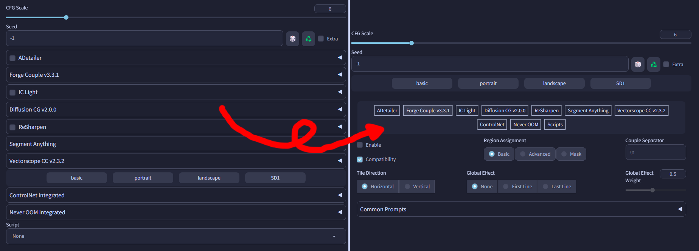

# SD Webui Tabs Extension
This is an Extension for the [Automatic1111 Webui](https://github.com/AUTOMATIC1111/stable-diffusion-webui), which replaces the original Extension layout with a **Tab** system instead.

> Also supports both old & new [Forge](https://github.com/lllyasviel/stable-diffusion-webui-forge)

<i>(<a href="https://github.com/Haoming02/catppuccin-theme">Catppuccin Theme</a>)</i>

## Features
This was achieved by moving the *contents* of each Extension from the "**Accordion**" *(the dropdown thingy)* into their own separate **Tab**s, so that you only need to switch between each tab to change the settings, instead of scrolling all the way down and then all the way up every single time.

When an Extension or a Script is enabled, the respective Tab button will turn green[*](#settings) to indicate that. Additionally, you can `Ctrl + Click` the Tab button to quickly toggle the Extension.

> [!Note]
> This tries to find the first **Checkbox** with a label containing "enable" or "active" within the Extension. If one is not found, this feature will not be available for said Extension.

> For ControlNet, this only works on the first Unit. Still thinking of a better solution...

## Configs
After launching the Webui *(including the browser, not just the console)* with this Extension installed, it will generate a `tab_configs.csv` file inside the folder. You can edit this file with any text editing program *(**eg.** `Notepad`)* or a spreadsheet program *(**eg.** `Excel`)*, to change where each element is placed:

- <ins><b>entries</b></ins>
    - `tabs` entry controls where the buttons for the Tabs are placed
    - `default` entry controls where new Extensions should be placed
    - `Scripts` entry refers to the Scripts dropdown
    - `Extra Options` entry refers to the  `Settings for txt2img/img2img` *(if enabled in settings)*
    - The rest of the entries are the installed extensions

- <ins><b>placement</b></ins>
    - The `left` side refers to under the parameters *(the original location)*
    - The `right` side refers to under the generation gallery
    - The `above` refers to above the tab buttons entry
    - The `below` refers to below the tab buttons entry
    - The `hide` will not show the extension instead
        - Mainly for extensions with some sort of always-active functionality

> [!Note]
> Extensions set to `above` and `below` will always be shown without tab buttons

> [!Important]
> If you edited the `.csv` file while the Webui is active, you should click **Reload UI** to apply the changes *(not just refresh the browser)*

- <ins><b>Example Config:</b></ins>

    |       | txt | img |
    |-------|-----|-----|
    |  tabs | left|right|
    |default| left|right|
    |ar-plus|above|above|
    |  ...  | left|right|
    |  ...  | left|right|
    |Scripts|below|below|

## Settings
> The settings are in the **Tabs Extension** section under the <ins>User Interface</ins> category

- **Delay:** This Extension moves the contents after a tiny delay to prevent breaking some references
    - If you have a slow machine, you *may* need to increase the delay
- **Color:** The CSS color used to indicate active extensions *(**Default:** `GreenYellow`)*
- **Version:** Hide the version number for the Extensions *(**not** recommended)*
- **Forge:** Hide the "Integrated" text for the built-in Extensions
- **Sort:** By default, extensions are sorted based on their order of appearance *(**ie.** The folder names or the `sorting_priority` variable)*; Enable this to sort them based on the order in the `tab_configs.csv`
- **Toggle:** Allow you to click on the button of an opened tab to hide it instead
- **Open:** By default, first extension is shown; You can hide all the extensions on start up instead
- **Hide Container:** By default, this Extension only moves the contents and hide the Accordions, leaving the extension container untouched. When using certain themes that add margins and paddings, the container may show up as an empty block instead. If you do not have any leftover extensions in the container *(**ie.** Those without Accordion in its UI)*, you can hide the entire container instead.
