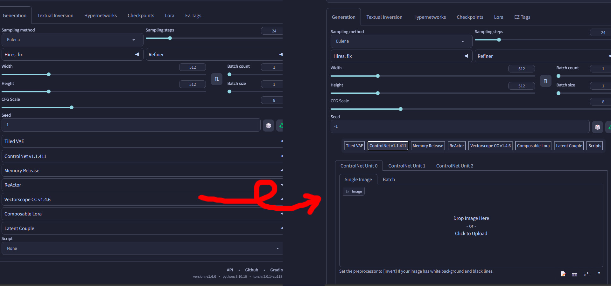

# SD Webui Tabs Extension

<i><b>BETA</b></i>

This is an Extension for the [Automatic1111 Webui](https://github.com/AUTOMATIC1111/stable-diffusion-webui), which replaces the original Extension layout with a Tab System instead.

## Intro
This was achieved by moving the *contents* of each Extension from the "Accordion" *(the dropdown thingy)* into their own separate Tabs, 
so that you only need to switch between each tab to change the settings, instead of scrolling all the way down and then all the way up every single time. 
This is especially helpful if you usually have multiple Extensions active.
Additionally, the `Scripts` section is also moved into a tab.

When an Extension or a Script is enabled, the respective Tab button will turn green to indicate that. Furthermore, you can `Ctrl + Click` the Tab buttons to quickly toggle the Extensions.
> This tries to find the first Checkbox with a label containing "enable" or "active" within the Extension. If one is not found, then this feature will not be available for said Extension!

## Configs
After launching the Webui *(including the browser, not just the console)* with this Extension installed, it will generate a `tab_configs.csv` file inside the Extension folder.
You can edit this file to change which side each element is placed. 
- **left** side refers to under the parameters *(the original location)*
- **right** side refers to under the generation Results
- The `t2i` and `i2i` entries control where the Tab buttons are placed
- The `default` controls where each new Extension not in the config should be placed
- Then the rest *should* contain all available Extensions found

> You can open the `.csv` file with any text editing program, or a spreadsheet program like Excel. Highly recommended to not touch the first column.

### Settings
> The settings are in the **User interface** section
- **Delay:** This Extension moves the contents after a tiny delay to prevent breaking some references. If you have a slow machine, you *may* need to increase the delay.

 **Note:** This Extension is still ***experimental***. The few Extensions I installed worked fine during my testing. However, I cannot guarantee that every single Extension will function properly, yet. 
